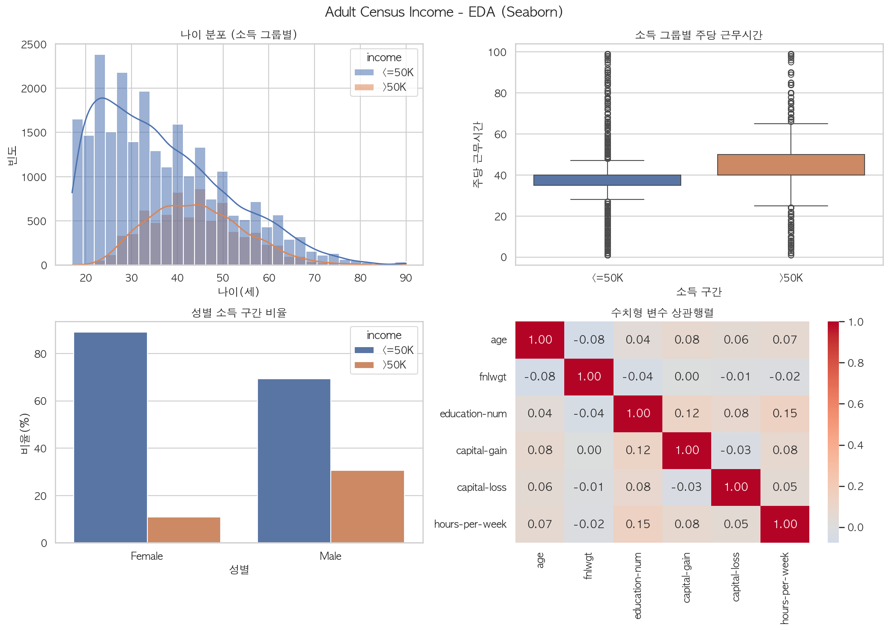

# Adult Census Income 분석 리포트

- 작성: SKALA 광주 캠퍼스 4반 2조 / 박영서
- 데이터 출처: https://archive.ics.uci.edu/ml/machine-learning-databases/adult/adult.data
- 총 실행 시간: 1.85초

> 이 문서는 `python -m src.run_pipeline` 실행 시 자동 생성됩니다.

## 1. 데이터 준비 — Pandas vs Polars

| 항목 | Pandas | Polars |
| --- | --- | --- |
| shape | (32561, 15) | (32561, 15) |
| 결측치 총계 | 4,262 | 4,262 |
| 로딩 시간(초) | 0.0151 | 0.0059 |

- 두 도구의 로딩 결과(행·열 수, 결측치 총계)는 **동일**합니다.
- 측정 방법: 로딩 1회만 재면 Polars 첫 호출에 스레드 풀 초기화 비용이 섞여 실행할 때마다 우열이 뒤바뀝니다. 예열 2회를 버린 뒤 10회를 측정해 **중앙값**을 사용했습니다.
- 로딩 속도: **Polars(Lazy API)가 Pandas 대비 약 2.55배 빠름.**

## 2. 기본 EDA

- 원본 규모: **32,561행 × 15열**
- 중복 행: **24행**

### 결측치 현황

| 컬럼 | 결측 건수 | 비율(%) |
| --- | ---: | ---: |
| workclass | 1,836 | 5.64 |
| occupation | 1,843 | 5.66 |
| native-country | 583 | 1.79 |

### 범주형 변수 분포 (상위 3개)

| 컬럼 | 고유값 수 | 1위 | 2위 | 3위 |
| --- | ---: | --- | --- | --- |
| workclass | 8 | Private (73.87%) | Self-emp-not-inc (8.27%) | Local-gov (6.81%) |
| education | 16 | HS-grad (32.25%) | Some-college (22.39%) | Bachelors (16.45%) |
| marital-status | 7 | Married-civ-spouse (45.99%) | Never-married (32.81%) | Divorced (13.65%) |
| occupation | 14 | Prof-specialty (13.48%) | Craft-repair (13.34%) | Exec-managerial (13.24%) |
| relationship | 6 | Husband (40.52%) | Not-in-family (25.51%) | Own-child (15.56%) |
| race | 5 | White (85.43%) | Black (9.59%) | Asian-Pac-Islander (3.19%) |
| sex | 2 | Male (66.92%) | Female (33.08%) |  |
| native-country | 41 | United-States (91.22%) | Mexico (2.01%) | Philippines (0.62%) |
| income | 2 | <=50K (75.92%) | >50K (24.08%) |  |

### 전처리 이력

- 중복 제거: 24행
- 범주형 결측치 최빈값 대체: 4261건
- 수치형 결측치 중앙값 대체: 0건
- 전처리 후 규모: **32,537행**

### 최빈값 대체가 분포에 준 영향

| 컬럼 | 최빈값 | 대체 건수 | 대체 전 | 대체 후 | 증가폭 |
| --- | --- | ---: | ---: | ---: | ---: |
| workclass | Private | 1,836 | 73.87% | 75.33% | +1.46%p |
| occupation | Prof-specialty | 1,843 | 13.48% | 18.38% | +4.9%p |
| native-country | United-States | 583 | 91.22% | 91.39% | +0.17%p |

- 같은 최빈값 대체라도 컬럼에 따라 영향이 크게 다릅니다. `occupation`은 최빈값 비율이 13.48%로 낮아 대체 후 **+4.9%p** 부풀려진 반면, 이미 한 범주가 지배적인 컬럼은 거의 변하지 않았습니다.
- 최빈값이 지배적이지 않은 컬럼에는 별도 범주(`Unknown`)로 두거나 결측 자체를 정보로 쓰는 방식이 더 적절할 수 있습니다.

### 타깃 분포

| 소득 구간 | 인원 | 비율(%) |
| --- | ---: | ---: |
| <=50K | 24,720 | 75.9 |
| >50K | 7,841 | 24.1 |

## 3. 시각화

- Seaborn 정적 차트(2×2): `outputs/figures/eda_seaborn.png`
- Plotly 인터랙티브 차트: `outputs/figures/eda_plotly.html`



## 4. 통계 분석

### 4-1. 기술통계

|                |   count |      mean |       std |   min |    25% |    50% |    75% |            max |
|:---------------|--------:|----------:|----------:|------:|-------:|-------:|-------:|---------------:|
| age            |   32537 |     38.59 |     13.64 |    17 |     28 |     37 |     48 |    90          |
| fnlwgt         |   32537 | 189781    | 105556    | 12285 | 117827 | 178356 | 236993 |     1.4847e+06 |
| education-num  |   32537 |     10.08 |      2.57 |     1 |      9 |     10 |     12 |    16          |
| capital-gain   |   32537 |   1078.44 |   7387.96 |     0 |      0 |      0 |      0 | 99999          |
| capital-loss   |   32537 |     87.37 |    403.1  |     0 |      0 |      0 |      0 |  4356          |
| hours-per-week |   32537 |     40.44 |     12.35 |     1 |     40 |     40 |     45 |    99          |

### 4-2. 상관계수

|                |    age |   fnlwgt |   education-num |   capital-gain |   capital-loss |   hours-per-week |
|:---------------|-------:|---------:|----------------:|---------------:|---------------:|-----------------:|
| age            |  1     |   -0.076 |           0.036 |          0.078 |          0.058 |            0.069 |
| fnlwgt         | -0.076 |    1     |          -0.043 |          0     |         -0.01  |           -0.019 |
| education-num  |  0.036 |   -0.043 |           1     |          0.123 |          0.08  |            0.148 |
| capital-gain   |  0.078 |    0     |           0.123 |          1     |         -0.032 |            0.078 |
| capital-loss   |  0.058 |   -0.01  |           0.08  |         -0.032 |          1     |            0.054 |
| hours-per-week |  0.069 |   -0.019 |           0.148 |          0.078 |          0.054 |            1     |

상관계수 절댓값 상위 5쌍:

- `education-num` ↔ `hours-per-week` : **+0.148**
- `education-num` ↔ `capital-gain` : **+0.123**
- `education-num` ↔ `capital-loss` : **+0.080**
- `age` ↔ `capital-gain` : **+0.078**
- `capital-gain` ↔ `hours-per-week` : **+0.078**

### 4-3. t-test (독립표본)

- 검정: Welch's independent t-test
- 비교 변수: `hours-per-week` / 그룹: `income`
- <=50K 평균 = **38.843** (n=24,698)
- >50K 평균 = **45.473** (n=7,839)
- t 통계량 = **-45.095**, p-value = **< 1e-308**
- 해석: p=< 1e-308 < 0.05 → 귀무가설 기각. '<=50K' 그룹과 '>50K' 그룹의 hours-per-week 평균에 차이가 있다(통계적으로 유의).

### 4-4. 카이제곱 독립성 검정

- 대상: `sex` × `income`

| sex    |   <=50K |   >50K |
|:-------|--------:|-------:|
| Female |    9583 |   1179 |
| Male   |   15115 |   6660 |

- χ² = **1516.5397**, 자유도 = 1, p-value = **< 1e-308**
- 해석: p=< 1e-308 < 0.05 → 귀무가설 기각. 'sex'와(과) 'income'는 서로 연관이 있다(통계적으로 유의).

## 5. ML Pipeline

- 모델: **RandomForestClassifier** (sklearn `Pipeline` + `ColumnTransformer`)
- 학습/테스트: 26,029행 / 6,508행

| 지표 | 값 |
| --- | ---: |
| Accuracy | 0.8175 |
| F1 (macro) | 0.7842 |
| F1 (>50K) | 0.6995 |
| ROC-AUC | 0.9213 |

### 분류 리포트

```
              precision    recall  f1-score   support

       <=50K      0.955     0.797     0.869      4940
        >50K      0.580     0.882     0.700      1568

    accuracy                          0.817      6508
   macro avg      0.767     0.839     0.784      6508
weighted avg      0.865     0.817     0.828      6508
```

### 혼동 행렬

| 실제 \ 예측 | <=50K | >50K |
| --- | ---: | ---: |
| <=50K | 3,937 | 1,003 |
| >50K | 185 | 1,383 |

### 피처 중요도 상위 10

| 피처 | 중요도 |
| --- | ---: |
| cat__marital-status_Married-civ-spouse | 0.1601 |
| num__education-num | 0.1262 |
| num__age | 0.1017 |
| cat__relationship_Husband | 0.0987 |
| num__capital-gain | 0.0954 |
| cat__marital-status_Never-married | 0.0649 |
| num__hours-per-week | 0.0577 |
| cat__relationship_Own-child | 0.0326 |
| num__capital-loss | 0.0248 |
| cat__relationship_Not-in-family | 0.0235 |

- 모델 저장 경로: `outputs/models/income_pipeline.joblib`
- 저장 모델 재로딩 검증: **성공**

## 6. 결론 및 개선 의견

- 주당 근무시간은 소득 구간에 따라 평균 차이가 뚜렷했고(p=< 1e-308), 성별과 소득 구간도 독립이 아니었습니다(p=< 1e-308).
- RandomForest 파이프라인은 정확도 81.8%, ROC-AUC 0.921로 기준선(다수 클래스 예측 약 76%)을 상회했습니다.
- 개선 방향
  - 클래스 불균형 대응으로 `class_weight` 외에 임계값 튜닝·SMOTE 비교 필요
  - `capital-gain`의 극단적 편향을 로그 변환 또는 구간화로 완화
  - 교차검증(`cross_val_score`)과 하이퍼파라미터 탐색으로 일반화 성능 검증
  - 데이터 규모가 커지면 전처리를 Polars Lazy API로 이관해 처리 시간 단축
