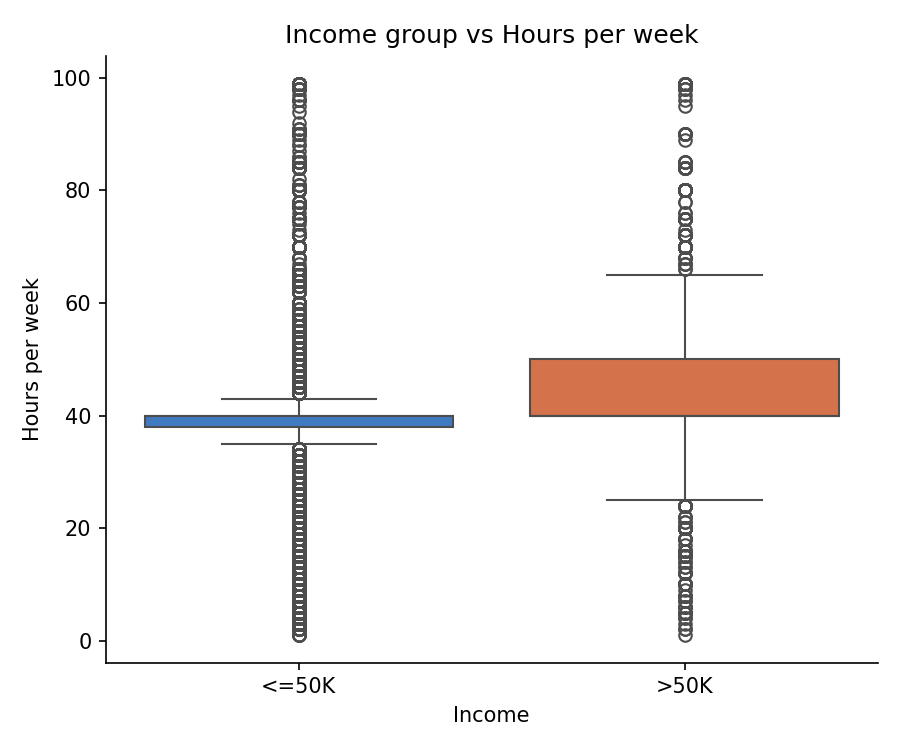
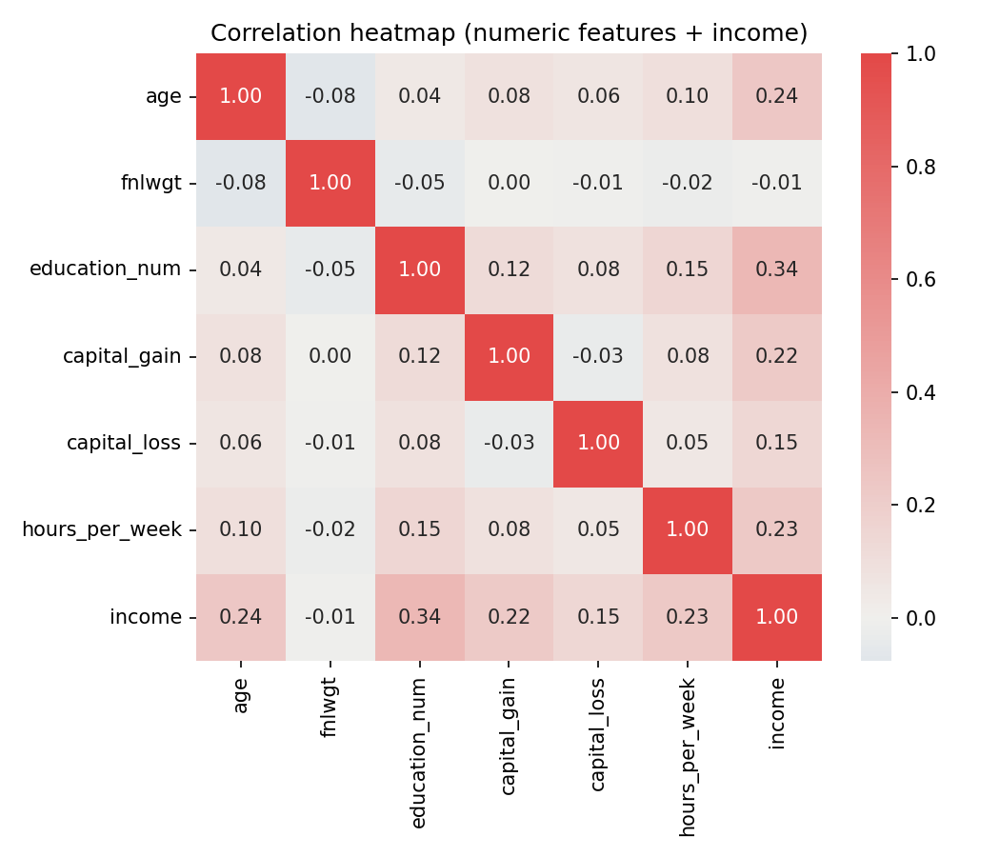

# Adult Census Income — 로지스틱 회귀 분석 리포트

## 1. 데이터 개요 및 Pandas vs Polars 로딩 비교

- 원본 데이터 shape: `(32561, 15)`
- Pandas 로딩 시간: `0.0192초`
- Polars 로딩 시간: `0.0183초`

| 컬럼 | Pandas dtype | Polars dtype |
| --- | --- | --- |
| age | int64 | Int64 |
| workclass | object | String |
| fnlwgt | int64 | String |
| education | object | String |
| education_num | int64 | String |
| marital_status | object | String |
| occupation | object | String |
| relationship | object | String |
| race | object | String |
| sex | object | String |
| capital_gain | int64 | String |
| capital_loss | int64 | String |
| hours_per_week | int64 | String |
| native_country | object | String |
| income | object | String |

**주의할 차이점**

- 원본 파일 끝에 빈 줄이 하나 있다. Pandas는 기본값(skip_blank_lines=True)으로 이를 건너뛰지만, Polars는 이를 전 컬럼이 null인 행으로 읽어들여 행 수가 1 더 많다.
- ['fnlwgt', 'education_num', 'capital_gain', 'capital_loss', 'hours_per_week'] 컬럼은 CSV 값 앞에 공백(', 77516' 등)이 있어 Polars의 기본 스키마 추론에서는 숫자로 인식되지 못하고 String으로 로딩된다. 반면 Pandas의 C 파서는 숫자 파싱 시 앞뒤 공백을 자동으로 무시해 int64로 인식한다.

## 2. 전처리 요약

- 결측치 토큰(' ?') → NaN 변환 후 결측 비율 계산
- 결측치가 있는 행: 2399/32561 (비율 7.37%) → 결측 비율이 낮아 해당 행을 dropna로 제거
- dropna 이후 행 수: 30162
- 중복 행 제거: 30162 → 30139 (23건 제거)
- 최종 shape: (30139, 15)
- target(income) 클래스 비율: >50K = 24.90% (불균형 데이터 — <=50K 클래스가 다수)

## 3. EDA 요약

### 3-1. 기술통계 (수치형 변수)

| statistic | age | fnlwgt | education_num | capital_gain | capital_loss | hours_per_week |
| --- | --- | --- | --- | --- | --- | --- |
| count | 30139.0 | 30139.0 | 30139.0 | 30139.0 | 30139.0 | 30139.0 |
| mean | 38.4417 | 189795.026 | 10.1225 | 1092.8412 | 88.4399 | 40.9347 |
| std | 13.1314 | 105658.6243 | 2.5487 | 7409.1106 | 404.4452 | 11.9788 |
| min | 17.0 | 13769.0 | 1.0 | 0.0 | 0.0 | 1.0 |
| 25% | 28.0 | 117627.5 | 9.0 | 0.0 | 0.0 | 40.0 |
| 50% | 37.0 | 178417.0 | 10.0 | 0.0 | 0.0 | 40.0 |
| 75% | 47.0 | 237604.5 | 13.0 | 0.0 | 0.0 | 45.0 |
| max | 90.0 | 1484705.0 | 16.0 | 99999.0 | 4356.0 | 99.0 |

### 3-2. 상관계수 (수치형 변수 + income)

| feature | age | fnlwgt | education_num | capital_gain | capital_loss | hours_per_week | income |
| --- | --- | --- | --- | --- | --- | --- | --- |
| age | 1.0 | -0.0763 | 0.0432 | 0.0802 | 0.0601 | 0.1013 | 0.242 |
| fnlwgt | -0.0763 | 1.0 | -0.0452 | 0.0004 | -0.0098 | -0.023 | -0.009 |
| education_num | 0.0432 | -0.0452 | 1.0 | 0.1245 | 0.0796 | 0.1528 | 0.3354 |
| capital_gain | 0.0802 | 0.0004 | 0.1245 | 1.0 | -0.0323 | 0.0804 | 0.2212 |
| capital_loss | 0.0601 | -0.0098 | 0.0796 | -0.0323 | 1.0 | 0.0524 | 0.15 |
| hours_per_week | 0.1013 | -0.023 | 0.1528 | 0.0804 | 0.0524 | 1.0 | 0.2294 |
| income | 0.242 | -0.009 | 0.3354 | 0.2212 | 0.15 | 0.2294 | 1.0 |

## 4. 시각화

**Seaborn: income vs hours_per_week boxplot**



**Seaborn: 상관관계 heatmap**



- [Plotly: education별 고소득 비율](figures/income_ratio_by_education.html) (인터랙티브 HTML, 브라우저에서 열어 확인)
- [Plotly: marital_status별 고소득 비율](figures/income_ratio_by_marital_status.html) (인터랙티브 HTML, 브라우저에서 열어 확인)

## 5. 가설 검증 결과

### H1. >50K 그룹의 hours_per_week 가 유의하게 더 길다 (Welch's t-test)

- <=50K 그룹 평균: 39.35시간
- >50K 그룹 평균: 45.71시간
- t-statistic: 43.1697, p-value: 0
- 해석 (유의수준 0.05): p-value(0) < 유의수준(0.05) 이므로, >50K 그룹과 <=50K 그룹의 평균 hours_per_week 차이는 통계적으로 유의하다. (H1 채택: >50K 그룹 평균 45.71시간 vs <=50K 그룹 평균 39.35시간)

### H2. education_num이 높을수록 고소득 비율이 높다

- education_num과 income의 상관계수: 0.3354
- 해석: education_num과 income의 상관계수는 0.3354로 양의 상관관계를 보이며, education_num이 높은 그룹일수록 고소득(>50K) 비율이 대체로 증가한다. (H2 지지)

### H3. capital_gain은 소득과 강한 양의 관계를 가지는 핵심 예측 변수다

- capital_gain과 income의 상관계수: 0.2212
- 로지스틱 회귀 계수: 2.3753
- 해석: capital_gain과 income의 상관계수는 0.2212로 양의 상관관계를 보인다. 로지스틱 회귀 계수 또한 2.3753로 양의 값을 가져, capital_gain이 고소득을 예측하는 핵심 변수임을 뒷받침한다. (H3 지지)

### H4. marital_status/relationship에 따라 고소득 비율 차이가 크다

- marital_status 그룹 간 최대-최소 격차: 42.78%
- relationship 그룹 간 최대-최소 격차: 47.93%
- 해석: marital_status 그룹 간 고소득 비율 격차는 42.78%, relationship 그룹 간 격차는 47.93%로 모두 큰 차이를 보인다. (H4 지지)

## 6. ML 모델(로지스틱 회귀) 성능

- 학습 데이터: 24111건 / 테스트 데이터: 6028건

| 지표 | 값 |
| --- | --- |
| Accuracy | 0.8470 |
| Precision | 0.7337 |
| Recall | 0.6056 |
| F1-score | 0.6635 |
| ROC-AUC | 0.9005 |

> 주의: target 클래스가 불균형(>50K가 소수)하므로 accuracy만으로 모델 성능을 판단하지 않는다. Precision/Recall/F1/ROC-AUC를 함께 확인해야 소수 클래스 탐지력을 올바르게 평가할 수 있다.

### Confusion Matrix

```
[[4197  330]
 [ 592  909]]
```

### Classification Report

```
              precision    recall  f1-score   support

       <=50K       0.88      0.93      0.90      4527
        >50K       0.73      0.61      0.66      1501

    accuracy                           0.85      6028
   macro avg       0.81      0.77      0.78      6028
weighted avg       0.84      0.85      0.84      6028

```

### 로지스틱 회귀 계수 (상위 양/음 피처) 및 가설 연결 해석

| direction | feature | coefficient |
| --- | --- | --- |
| positive | capital_gain | 2.3753 |
| positive | marital_status_Married-civ-spouse | 1.2847 |
| positive | relationship_Wife | 1.1526 |
| positive | marital_status_Married-AF-spouse | 1.0899 |
| positive | native_country_France | 0.8824 |
| positive | native_country_Italy | 0.8307 |
| positive | occupation_Exec-managerial | 0.8065 |
| positive | native_country_Yugoslavia | 0.7812 |
| positive | education_num | 0.7288 |
| positive | native_country_Cambodia | 0.6932 |
| negative | native_country_Columbia | -1.2747 |
| negative | occupation_Priv-house-serv | -1.2642 |
| negative | relationship_Own-child | -1.1764 |
| negative | native_country_South | -1.1432 |
| negative | occupation_Farming-fishing | -1.105 |
| negative | marital_status_Never-married | -1.0581 |
| negative | sex_Female | -1.0037 |
| negative | native_country_Dominican-Republic | -0.8482 |
| negative | relationship_Other-relative | -0.8437 |
| negative | native_country_Vietnam | -0.8154 |

- capital_gain 계수가 강한 양수로 나타나 **H3**을 뒷받침한다.
- education_num 계수가 양수로 나타나 **H2**를 뒷받침한다.
- marital_status/relationship 관련 원-핫 피처들이 상위 계수에 다수 포함되어 **H4**를 뒷받침한다.

## 7. 로지스틱 회귀 모형 결과 해석

### 7-1. 예측 성능 관점

- ROC-AUC 0.9005는 모델이 실제 >50K와 <=50K를 확률적으로 잘 구분해낸다는 의미다(1에 가까울수록 완벽한 분리, 0.5는 무작위 수준과 동일). 0.9 안팎의 값은 이 문제에서 우수한 판별력으로 볼 수 있다.
- 테스트 6028명 중 실제 >50K인 사람은 1501명이며, 이 중 909명은 맞게 예측했지만(60.56% 재현율) 592명은 <=50K로 잘못 예측했다(False Negative). 반대로 실제 <=50K인 4527명 중 >50K로 잘못 예측한 경우는 330건(False Positive)에 그쳐, 모델의 오차는 '고소득자를 놓치는' 방향(재현율 저하)에 더 크게 치우쳐 있다.
- Precision 0.7337은 모델이 '>50K'로 예측한 사람 중 실제로 맞힌 비율로 비교적 신뢰할 수 있는 수준이지만, Recall 0.6056은 실제 고소득자의 약 39%를 놓친다는 뜻이다. target 클래스 불균형(>50K 소수)이 모델의 소수 클래스 탐지력에 영향을 준 것으로 해석된다.

### 7-2. 계수(오즈비) 관점

로지스틱 회귀 계수는 다른 변수를 고정했을 때 해당 피처가 1단위(수치형, 표준화 기준) 또는 해당 범주에 속할 때(범주형) '>50K일 오즈(odds)'에 곱해지는 배수, 즉 오즈비(odds ratio = exp(계수))로 해석할 수 있다.

| feature | coefficient | odds ratio | 해석 |
| --- | --- | --- | --- |
| capital_gain | 2.3753 | 10.75배 | 다른 조건이 같을 때 고소득(>50K) 오즈가 약 10.8배 증가 |
| marital_status_Married-civ-spouse | 1.2847 | 3.61배 | 다른 조건이 같을 때 고소득(>50K) 오즈가 약 3.6배 증가 |
| relationship_Wife | 1.1526 | 3.17배 | 다른 조건이 같을 때 고소득(>50K) 오즈가 약 3.2배 증가 |
| marital_status_Married-AF-spouse | 1.0899 | 2.97배 | 다른 조건이 같을 때 고소득(>50K) 오즈가 약 3.0배 증가 |
| native_country_France | 0.8824 | 2.42배 | 다른 조건이 같을 때 고소득(>50K) 오즈가 약 2.4배 증가 |
| native_country_Columbia | -1.2747 | 0.28배 | 다른 조건이 같을 때 고소득(>50K) 오즈가 약 72% 감소 |
| occupation_Priv-house-serv | -1.2642 | 0.28배 | 다른 조건이 같을 때 고소득(>50K) 오즈가 약 72% 감소 |
| relationship_Own-child | -1.1764 | 0.31배 | 다른 조건이 같을 때 고소득(>50K) 오즈가 약 69% 감소 |
| native_country_South | -1.1432 | 0.32배 | 다른 조건이 같을 때 고소득(>50K) 오즈가 약 68% 감소 |
| occupation_Farming-fishing | -1.1050 | 0.33배 | 다른 조건이 같을 때 고소득(>50K) 오즈가 약 67% 감소 |

- capital_gain(표준화 변수)의 계수가 가장 크며, 자본이득이 클수록 고소득 오즈가 10배 이상 뛴다 — H3을 가장 강하게 뒷받침하는 근거다.
- marital_status_Married-civ-spouse, relationship_Wife 등 혼인·가구 관계 관련 피처가 capital_gain 다음으로 큰 양의 계수를 가져, 개인의 재무·교육 수준 못지않게 가구 구조가 소득 예측에 강하게 기여함을 시사한다(H4).
- education_num은 양의 계수로 학력이 높을수록 고소득 오즈가 커짐을 재확인시켜준다(H2).
- 반대로 marital_status_Never-married, relationship_Own-child, sex_Female 등은 음의 계수를 가져 미혼·자녀 관계·여성일 경우 고소득 오즈가 낮아지는 방향으로 작용한다. sex_Female의 음의 계수는 데이터에 내재된 성별 소득 격차를 모델이 그대로 학습한 결과로 해석되며, 실제 활용 시 공정성(fairness) 관점의 추가 검토가 필요하다.
- native_country 관련 피처(프랑스, 이탈리아, 콜롬비아 등)도 상위권에 다수 등장하는데, 이는 해당 국가 출신 표본 수가 적어 계수 추정치의 분산이 커진 결과일 수 있으므로 절대적인 영향력으로 과잉 해석하지 않도록 주의한다.


### 7-3. 종합 결론

로지스틱 회귀 모형은 ROC-AUC 0.9005 수준의 우수한 판별력을 보이며, capital_gain·education_num과 같은 개인 재무/교육 지표뿐 아니라 marital_status·relationship과 같은 가구 구조 변수가 소득 수준을 예측하는 핵심 변수임을 확인했다. 다만 클래스 불균형으로 인해 재현율(0.6056)이 정밀도(0.7337)보다 낮아 실제 고소득자를 놓치는 오류가 상대적으로 많으므로, 고소득자 선별처럼 재현율이 중요한 목적으로 이 모델을 활용할 경우 분류 임계값(threshold) 조정이나 class_weight='balanced' 적용 등 추가 튜닝을 검토할 필요가 있다.

## 8. 산출물 목록

- 전처리 완료 데이터: `/Users/minchae/workspace/skala-gwangju-4class-team2/data/processed/adult_clean.csv`
- 학습된 모델: `/Users/minchae/workspace/skala-gwangju-4class-team2/outputs/model.joblib`
