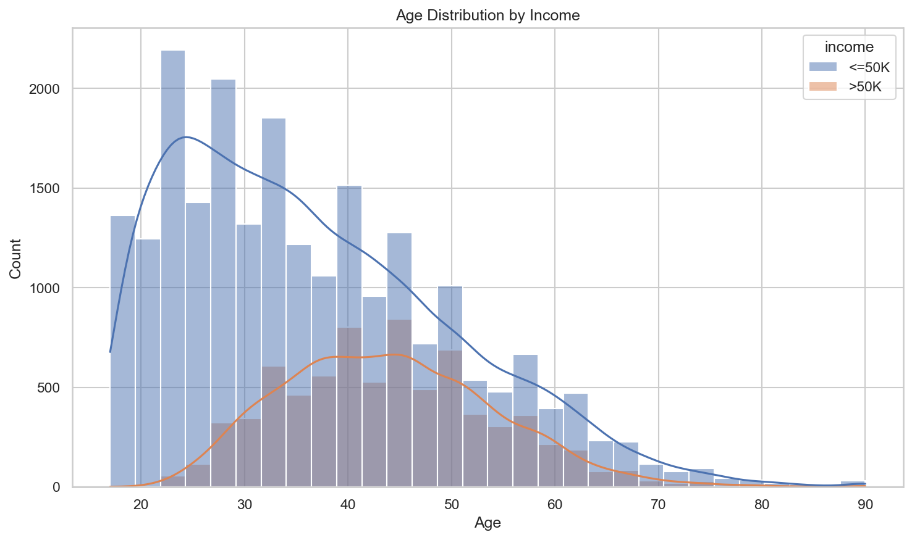
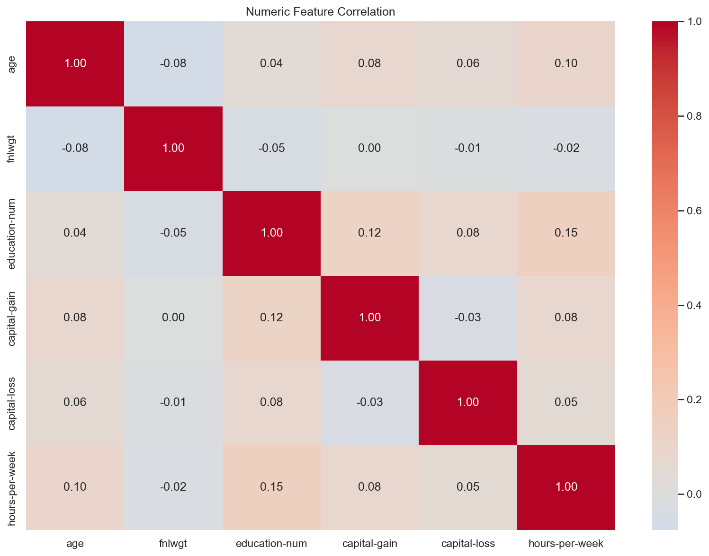

# Adult Income 데이터 분석 보고서

생성 시각: 2026-07-21 16:49:36 PDT

## 1. 데이터 및 전처리 개요

- 원본 데이터: 32,561행 × 15열
- 전처리 데이터: 30,139행 × 15열
- 결측치·중복 처리로 제거된 행: 2,422개
- 전처리 후 결측값: 0개
- 전처리 후 중복 행: 0개

### 소득 클래스 분포

| income | count |
| --- | --- |
| <=50K | 22633 |
| >50K | 7506 |

## 2. 기술통계

숫자형 변수의 평균, 표준편차와 사분위수입니다.

| index | mean | std | 25% | 50% | 75% |
| --- | --- | --- | --- | --- | --- |
| age | 38.4417 | 13.1314 | 28.0000 | 37.0000 | 47.0000 |
| fnlwgt | 189795.0260 | 105658.6243 | 117627.5000 | 178417.0000 | 237604.5000 |
| education-num | 10.1225 | 2.5487 | 9.0000 | 10.0000 | 13.0000 |
| capital-gain | 1092.8412 | 7409.1106 | 0.0000 | 0.0000 | 0.0000 |
| capital-loss | 88.4399 | 404.4452 | 0.0000 | 0.0000 | 0.0000 |
| hours-per-week | 40.9347 | 11.9788 | 40.0000 | 40.0000 | 45.0000 |

## 3. 변수 간 Pearson 상관계수

상관계수는 -1에서 1 사이이며, 절댓값이 클수록 두 변수의 선형 관계가 강합니다.

| index | age | fnlwgt | education-num | capital-gain | capital-loss | hours-per-week |
| --- | --- | --- | --- | --- | --- | --- |
| age | 1.0000 | -0.0763 | 0.0432 | 0.0802 | 0.0601 | 0.1013 |
| fnlwgt | -0.0763 | 1.0000 | -0.0452 | 0.0004 | -0.0098 | -0.0230 |
| education-num | 0.0432 | -0.0452 | 1.0000 | 0.1245 | 0.0796 | 0.1528 |
| capital-gain | 0.0802 | 0.0004 | 0.1245 | 1.0000 | -0.0323 | 0.0804 |
| capital-loss | 0.0601 | -0.0098 | 0.0796 | -0.0323 | 1.0000 | 0.0524 |
| hours-per-week | 0.1013 | -0.0230 | 0.1528 | 0.0804 | 0.0524 | 1.0000 |

## 4. 독립표본 t-test

- 분석 변수: `hours-per-week`
- 비교 그룹: `<=50K` vs `>50K`
- <=50K 표본 수·평균: 22,633개, 39.3520
- >50K 표본 수·평균: 7,506개, 45.7070
- t-statistic: -43.169744
- p-value: 0
- 유의수준: 0.05
- 해석: p-value가 0.05보다 작으므로 귀무가설을 기각합니다. 두 그룹의 평균에는 통계적으로 유의한 차이가 있습니다.

## 5. 머신러닝 모델 평가

전처리와 `LogisticRegression`을 하나의 sklearn Pipeline으로 구성했습니다.

| 지표 | 값 |
| --- | ---: |
| Accuracy | 0.8461 |
| Precision | 0.7327 |
| Recall | 0.6009 |
| F1-score | 0.6603 |
| ROC-AUC | 0.9006 |

### 혼동행렬

행은 실제 클래스, 열은 예측 클래스입니다.

| index | <=50K | >50K |
| --- | --- | --- |
| <=50K | 4198 | 329 |
| >50K | 599 | 902 |

### 저장 모델

- [adult_income_pipeline.joblib](models/adult_income_pipeline.joblib)

## 6. Seaborn 정적 시각화

### seaborn_age_distribution

### seaborn_correlation_heatmap

## 7. Plotly 인터랙티브 시각화

HTML 파일을 브라우저로 열어 확대, 축소와 마우스 오버 기능을 사용할 수 있습니다.

- [plotly_work_hours_by_income](charts/plotly_work_hours_by_income.html)
- [plotly_education_income_comparison](charts/plotly_education_income_comparison.html)
